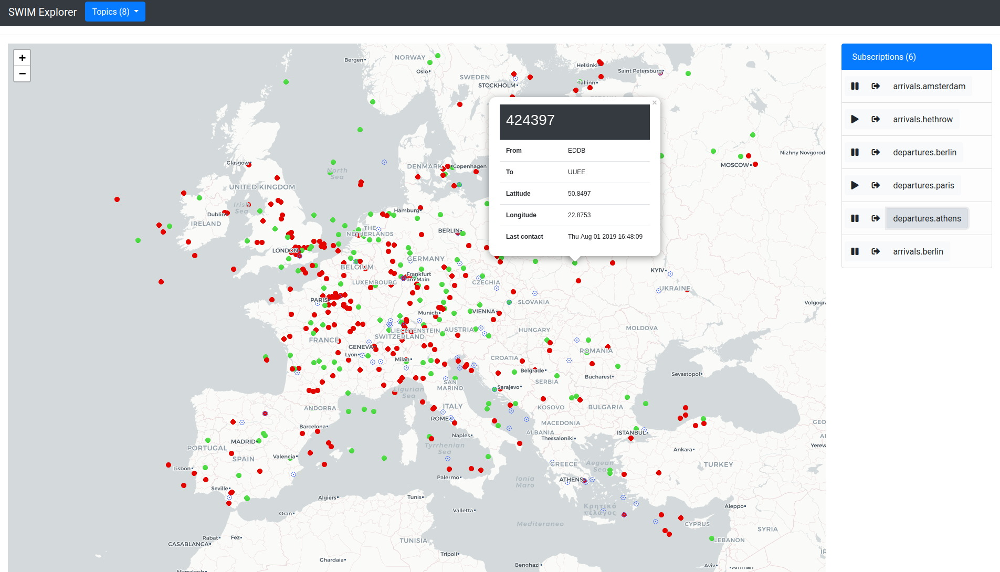

# SWIM deployment

## Overview
This document describes the procedure to get up and running a SWIM-TI demo platform which enables external client systems to 
get real time air traffic information. The real time air traffic is retrieved from [OpenSky Network](https://opensky-network.org)
based on arrivals and departures of pre-configured airports. Based on the SWIM-TI specifications, this demo utilises the AMQP v1.0 
protocol in order to enable a `producer` to publish real time air traffic data per topic (arrivals or departures of specific airports)
and a `consumer` to subscribe to one or more such topics and receive the relevant information.


More specifically, the main services involved are:

- **Subscription Manager**: is the core of the whole system wrapping up the broker where the data flows through by managing its topics 
to be published and its queues to consume from. It is supposed to be broker agnostic and for this demo [RabbitMQ](https://www.rabbitmq.com/)
is used as a broker. Moreover it stores topics' and subscriptions' metadata in a [PostgreSQL](https://www.postgresql.org/) 
database and it exposes a REST API based on the [OpenAPI](https://www.openapis.org/) specifications.
- **SWIM ADSB** is the `producer` implementation which publishes real time air traffic data of arrivals and departures to specific airports.
- **SWIM Explorer** is the `client` implementation which subscribes to arrival or departure topics and displays the air traffic in real time
on a map.

> Both SWIM ADSB and SWIM Explorer make use of the [SWIM PubSub](https://bitbucket.org/antavelos-eurocontrol/swim-pubsub/src/master/) 
mini framework which allows them to speak to the Subscription Manager as well as the broker.

The platform is designed with a microservices approach and is run with [docker](https://docker.com).

**TODO:** add architecture image

## Installation

### Step by step
The steps bellow will allow you to build and run the SWIM-TI demo from scratch. Make sure you follow them one by one in the given order.

#### Prerequisites
Before starting, make sure the following software is installed and working on your machine:
    
   - [git](https://git-scm.com/downloads) which will be used to download the necessary repositories.
   - [docker](https://docs.docker.com/install/) which will be used to host and run the whole demo platform
   - [docker-compose](https://docs.docker.com/compose/install/) which will be used for 


#### Download repositories
First we need to clone this repository:
```shell
git clone https://antavelos-eurocontrol@bitbucket.org/antavelos-eurocontrol/deploy.git
```

#### Configuration
Then we have to provide the necessary configuration of the services. This involves:

- setting up the required environment variables
- application specific configuration

##### Environment variables
The environment variables we need are user credentials for a DB user as well as credentials of Subscription Manager users. 

Run the following commands in your terminal (you may replace the values with your choice):
```shell
export DB_NAME=smdb
export DB_USER=swim
export DB_PASSWORD=swim
export SM_ADMIN_USERNAME=admin
export SM_ADMIN_PASSWORD=admin
export SWIM_ADSB_USERNAME=swim_adsb
export SWIM_ADSB_PASSWORD=swim_adsb
export SWIM_EXPLORER_USERNAME=swim_explorer
export SWIM_EXPLORER_PASSWORD=swim_explorer
```

##### Application config files
Under the apps folder you can find one folder per app containing a `config.yml` file. These are already configured but 
you may want to update the airports involved in the SWIM ADSB application. The config entry looks as following and you can 
add a new airport by choosing a name and assigning to it the corresponding ICAO code (more info [here](http://airportsbase.org/)).

The `INTERVAL_IN_SEC` variable defines the refresh rate of the air traffic data in seconds. The chosen value depends on the 
number of airports to retrieve information from as well as your internet speed:

```yaml

ADSB:
  CITIES:
    Brussels: 'EBBR'
    Amsterdam: 'EHAM'
    Paris: 'LFPG'
    Berlin: 'EDDB'
    Athens: 'LGAV'
    Hethrow: 'EGLL'
    <my city>: 'icao code' 
  INTERVAL_IN_SEC: 5
```

### Deployment
For the deployment process you can use the provided `shell` script `swim.sh`. Before using it though make it
executable with the following command:

```shell
cd deploy
chmod +x swim.sh
```

Moreover you can see the available options of this script with:
```shell
./swim.sh help
Usage: swim.sh [COMMAND] [OPTIONS]

Commands:
    build           Clones/updates the necessary git repositories and builds the involved docker images
    provision       Provisions the Subscription Manager with initial data (users)
    start           Starts up all the SWIM services
    start --prov    Starts up all the SWIM services after Provisioning the Subscription Manager with initial data
    stop            Stops all the services
    stop --clean    Stops all the services and cleans up the containers
    status          Displays the status of the running containers
```

In order to get the demo platform up and running we first need to download the necessary repositories and build the 
involved docker images with the following command:

> The first time you run this command it will take some time because of the download/build of docker images.

```shell
./swim.sh build
```

After the necessary images are downloaded we are ready to get the services up and running. Before that
we'll need to provision the Subscription Manager with some initial data about the involved users and this can be done with:

> this has to be run only the first time we start SWIM
 
```shell
./swim provision
```

and then we can start the services:

```shell
./swim.sh start
```

> the two commands above can be run in one step with `./swim.sh start --prov`

In order to make sure that all services (docker containers) are running you can run:
```shell
./swim.sh status
```

and you should see something similar to:
```shell
CONTAINER ID        IMAGE                  COMMAND                  CREATED              STATUS              PORTS                                                                     NAMES
9c71654ca34b        swim-explorer          "/usr/bin/tini -- ba…"   About a minute ago   Up About a minute   0.0.0.0:5000->5000/tcp                                                    swim_explorer
3d4746c48354        nginx                  "nginx -g 'daemon of…"   About a minute ago   Up About a minute   0.0.0.0:80->80/tcp, 0.0.0.0:443->443/tcp                                  nginx
645e40b8827a        swim-adsb              "/usr/bin/tini -- ba…"   About a minute ago   Up About a minute                                                                             swim_adsb
a8ffd7d67b7d        subscription-manager   "/usr/bin/tini -- gu…"   About a minute ago   Up About a minute   0.0.0.0:8080->8080/tcp                                                    subscription_manager
0ba8dd7aa1cb        rabbitmq_amqp10        "docker-entrypoint.s…"   About a minute ago   Up About a minute   4369/tcp, 5671-5672/tcp, 15671/tcp, 25672/tcp, 0.0.0.0:15672->15672/tcp   rabbitmq
645b4de022e4        postgres               "docker-entrypoint.s…"   About a minute ago   Up About a minute   0.0.0.0:5432->5432/tcp                                                    postgres
```

Lastly, in order to tear the platform down you can do:

```shell
./swim.sh stop
```

or if you also want to remove completely the involved docker containers you can do:
```shell
./swim.sh stop --clean
```

In case there is a change on the involved repositories you can update them and them by calling:
```shell
./swim.sh stop --clean  # if SWIM is up running
./swim.sh build
```

### Usage

As soon as the platform is up and running, you can point your browser to [http://0.0.0.0:5000](http://0.0.0.0:5000) in order to access SWIM Explorer and play around. You can subscribe, pause, resume or unsubscribe from topics like `arrivals.brussels`
and see the real time position of the involved aircrafts on the map.

> SWIM Explorer is supposed to be a client application, .i.e out of the scope of SWIM-TI platform. However, for the purpose of 
this demo it comes together with the rest of the services, but it runs as a standalone web application not passing through nginx.



