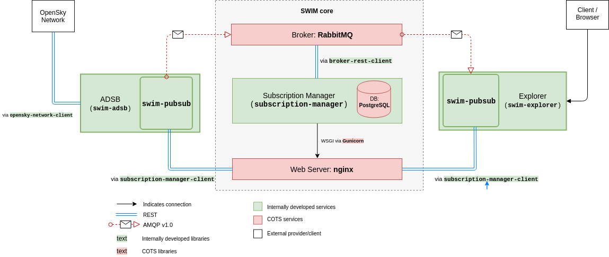
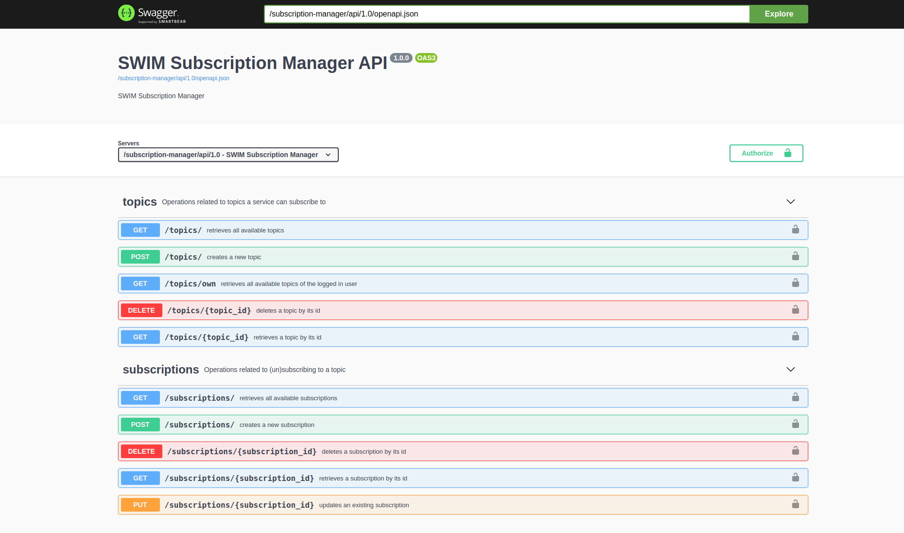
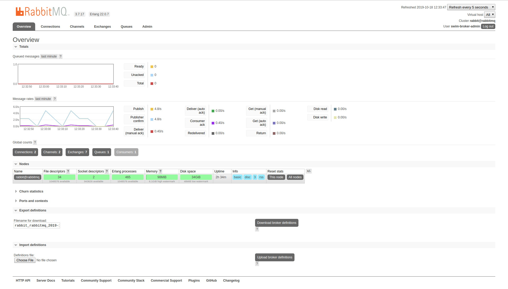

# SWIM-TI Yellow Profile Prototype

## Overview
This document describes the procedure to get up and running a SWIM-TI demo platform which enables external client systems to 
get real time air traffic information. The real time air traffic is retrieved from [OpenSky Network](https://opensky-network.org)
based on arrivals and departures of pre-configured airports. Based on the SWIM-TI specifications, this demo utilises the AMQP v1.0 
protocol in order to enable a `producer` to publish real time air traffic data per topic (arrivals or departures of specific airports)
and a `consumer` to subscribe to one or more such topics and receive the relevant information.


More specifically, the main services involved are:

- **Subscription Manager**: is the core of the whole system wrapping up the broker where the data flows through by managing its topics 
to be published and its queues to consume from. It is supposed to be broker agnostic and for this demo [RabbitMQ](https://www.rabbitmq.com/)
is used as a broker. Moreover it stores topics' and subscriptions' metadata in a [PostgreSQL](https://www.postgresql.org/)
database and it exposes a REST API based on the [OpenAPI](https://www.openapis.org/) specifications.
- **SWIM ADSB** is the `producer` implementation which publishes real time air traffic data of arrivals and departures to specific airports.
- **SWIM Explorer** is the `consumer` implementation which subscribes to arrival or departure topics and displays the air traffic in real time
on a map.

> Both SWIM ADSB and SWIM Explorer make use of the [pubsub-facades](https://github.com/eurocontrol-swim/pubsub-facades)
library which allows them to speak to the Subscription Manager as well as the broker.

The platform is designed with a microservices approach and is run with [docker](https://docker.com).

Below you can see the architecture design diagram along with the relationships of the COTS as well as the internally developed
services and libraries:




## Installation

### Step by step
The steps bellow will allow you to build and run the SWIM-TI demo from scratch. Make sure you follow them one by one in the given order.

#### Prerequisites
Before starting, make sure the following software is installed and working on your machine:
    
##### **Linux/Mac users**
   - [git](https://git-scm.com/downloads) which will be used to download the necessary repositories.
   - [docker](https://docs.docker.com/install/) which will be used to host and run the whole demo platform
   - [docker-compose](https://docs.docker.com/compose/install/) which will be used to orchestrate the deployment locally
   - [python](https://www.python.org/downloads/) which will be used to run python custom scripts 

##### **Windows users**
   - [Docker Toolbox on Windows](https://docs.docker.com/toolbox/toolbox_install_windows/) (which installs all the
   required tools and runs the Docker Engine via VirtualBox)
   - [python](https://www.python.org/downloads/) which will be used to run python custom scripts

###### Post-installation
   - Before using git commands you need to disable conversion of checked out files to Windows format:
        ```
        git config --global core.autocrlf input
        ```
   - Since Docker runs via VirtualBox, the various app/server sites involved in this demo will not be able to be accessed
     from your host machine unless you apply some port forwarding rules. You may find instructions about how to do it
     [here](https://www.simplified.guide/virtualbox/port-forwarding). The rules that we need are:

        | Name | Host port | Guest Port |
        |---|---|---|
        | broker | 15671 | 15671 |
        | https | 443 | 443 |
        | explorer | 5000 | 5000 |


#### Download repositories

> **NOTE**: The next steps are done on a Unix-like command line interface (CLI) for all users. Linux and Mac users can
> use any terminal application, however the Windows users will have to use the Docker CLI client that comes with Docker
> Toolbox on Windows. This can be accessed by starting **Docker Quickstart Terminal**.

First we need to clone this repository:

```shell
git clone https://github.com/eurocontrol-swim/SWIM-TI-YP-prototype.git
cd SWIM-TI-YP-prototype
```

#### Configuration
Then we have to provide the necessary configuration of the services. This involves:

- setting up the required users
- application specific configuration

##### SWIM users
Several users are required across the SWIM platform such as db users, broker users etc.
You can use the following command in order to generate them automatically:
```shell
. ./swim.sh user_config
```

> the leading `.` before `./swim.sh user_config` is required in order the provided usernames and passwords to be exported 
> as environment variables on the host machine

The output will look like:

```shell
SWIM user configuration...
==========================

Database user
[OK]
Subscription Manager admin user
[OK]

SWIM ADSB user for Subscription Manager
[OK]

SWIM Explorer user for Subscription Manager
[OK]

Broker admin user
[OK]

Broker Management user
[OK]

SWIM Explorer user for the broker
[OK]
```


However, you can always choose your own usernames/passwords by using the prompt option of the command:
```shell
. ./swim.sh user_config --prompt
```

> Passwords can take any character and need to be 10 or more characters long. Each provided password will be
checked for robustness and if it is deemed that it is not robust enough you will be re-prompted to choose a different one.

The interaction will look like:

```shell
SWIM user configuration...
==========================

Database user
 username: swim 
 password: 
[OK]

Subscription Manager admin user
 username: sm-admin 
 password: 
[OK]

SWIM ADSB user for Subscription Manager
 username: swim-adsb 
 password: 
The password is not strong enough. Please try again:
 password: 
[OK]

SWIM Explorer user for Subscription Manager
 username: swim-explorer 
 password: 
[OK]

Broker admin user
 username: swim-broker-admin 
 password: 
[OK]

Broker Management user
 username: swim-broker-mgmt 
 password: 
[OK]

SWIM Explorer user for the broker
 username: swim-explorer-broker 
 password: 
[OK]
```


You can verify that the provided usernames and passwords were exported as environment variables by issuing the following
command:

```shell
env
```

##### Application config files
Under the services folder you can find one folder per app containing a `config.yml` file. These are already configured but 
you may want to update the airports involved in the SWIM ADSB application. The config entry looks as following and you can 
add a new airport by choosing a name and assigning to it the corresponding ICAO code (more info [here](http://airportsbase.org/)).

The `INTERVAL_IN_SEC` variable defines the refresh rate of the air traffic data in seconds. The chosen value depends on the 
number of airports to retrieve information from as well as your internet speed:

```yaml

ADSB:
  CITIES:
    Brussels: 'EBBR'
    Amsterdam: 'EHAM'
    Paris: 'LFPG'
    Berlin: 'EDDB'
    Athens: 'LGAV'
    Heathrow: 'EGLL'
    <my city>: 'icao code' 
  INTERVAL_IN_SEC: 5
```

### Deployment
For the deployment process you can use the provided `shell` script `swim.sh`. Before using it though make it
executable with the following command:

```shell
chmod +x swim.sh
```

Moreover you can see the available options of this script with:
```shell
./swim.sh help
Usage: swim.sh [COMMAND] [OPTIONS]

Commands:
    user_config             Generates username/password for all the SWIM related users
    user_config --prompt    Prompts for username/password for all the SWIM related users
    build                   Clones/updates the necessary git repositories and builds the involved docker images
    provision               Provisions the Subscription Manager with initial data (users)
    start                   Starts up all the SWIM services
    stop                    Stops all the services
    stop --clean            Stops all the services and cleans up the containers
    status                  Displays the status of the running containers
```

In order to get the demo platform up and running we first need to download the necessary repositories and build the 
involved docker images with the following command:
 
```shell
./swim.sh build
```

> The first time you run this command it will take some time because of the download/build of docker images.
> this has to be run only the first time we start SWIM

> In case you run this command after having deployed successfully SWIM all the old data will be removed.


After the necessary images are built we are ready to get the services up and running. Before that
we'll need to provision the Subscription Manager and the broker with some initial data about the involved users and this 
can be done with:
 
```shell
./swim.sh provision
```
> this has to be run only the first time we start SWIM

and then we can start the services:

```shell
./swim.sh start
```

In order to make sure that all services (docker containers) are running you can run:
```shell
./swim.sh status
```

and you should see something similar to:
```shell
CONTAINER ID        IMAGE                  COMMAND                  CREATED              STATUS              PORTS                                                                     NAMES
9c71654ca34b        swim-explorer          "/usr/bin/tini -- ba…"   About a minute ago   Up About a minute   0.0.0.0:5000->5000/tcp                                                    swim_explorer
3d4746c48354        nginx                  "nginx -g 'daemon of…"   About a minute ago   Up About a minute   0.0.0.0:80->80/tcp, 0.0.0.0:443->443/tcp                                  nginx
645e40b8827a        swim-adsb              "/usr/bin/tini -- ba…"   About a minute ago   Up About a minute                                                                             swim_adsb
a8ffd7d67b7d        subscription-manager   "/usr/bin/tini -- gu…"   About a minute ago   Up About a minute   0.0.0.0:8080->8080/tcp                                                    subscription_manager
0ba8dd7aa1cb        rabbitmq_amqp10        "docker-entrypoint.s…"   About a minute ago   Up About a minute   4369/tcp, 5671-5672/tcp, 15671/tcp, 25672/tcp, 0.0.0.0:15672->15672/tcp   rabbitmq
645b4de022e4        postgres               "docker-entrypoint.s…"   About a minute ago   Up About a minute   0.0.0.0:5432->5432/tcp                                                    postgres
```

### Usage

#### SWIM Explorer
As soon as the platform is up and running, you can point your browser to [http://0.0.0.0:5000](http://0.0.0.0:5000) in
order to access SWIM Explorer and play around. You can subscribe, pause, resume or unsubscribe from topics like
`arrivals.brussels` and see the real time position of the involved airplanes on the map. The interface will look similar
to the below image:


> NOTE: SWIM Explorer is supposed to be a client application, .i.e out of the scope of SWIM-TI platform. However, for
> the purpose of this demo it comes together with the rest of the services, but it runs as a standalone web application
> not passing through the web server.


#### SWIM Subscription Manager
Additionally, you may access the SWIM Subscription Manager OpenAPI specs site using the following link:
[https://localhost/subscription-manager/api/1.0/ui/#/](https://localhost/subscription-manager/api/1.0/ui/#/). Notice
that you may get a warning saying the the connections if not safe. This is expected as this demo uses mock certificates
and not real ones. In there you can interact with it by observing the various transactions of topics and subscriptions
that happen while using SWIM Explorer. You can login using the user and password you provided during the user
configuration step earlier. The interface will look like the following image:



#### RabbitMQ Management
Lastly, you can also access the RabbitMQ management page using the following link:
[https://localhost:15671/#/](https://localhost:15671/#/). Notice that you may get a warning saying the the connections 
if not safe. This is expected as this demo uses mock certificates and not real ones. In there you can observe the queues
that are created/deleted while using SWIM Explorer as well as statistics about the flow of the incoming messages. You
can login using the user and password you provided during the user configuration step earlier. The interface will look
similar to the following image:



### Stopping the Platform


In order to tear the platform down you can do:

```shell
./swim.sh stop
```

or if you also want to remove completely the involved docker containers you can do:
```shell
./swim.sh stop --clean
```

In case there is a change on the involved repositories you can update them by calling:
```shell
./swim.sh stop --clean  # if SWIM is up running
./swim.sh build
```
