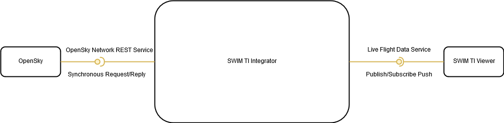
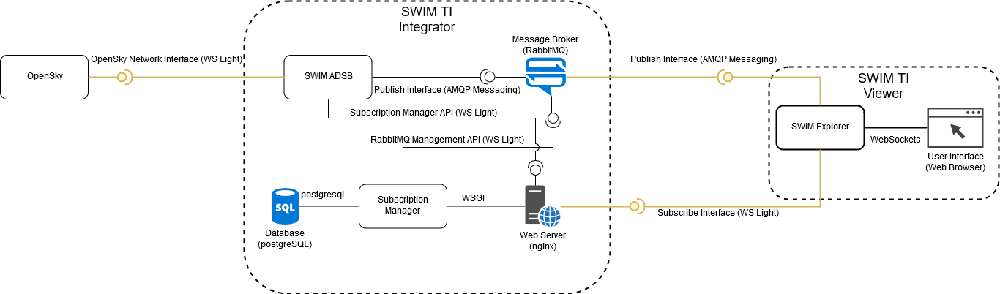
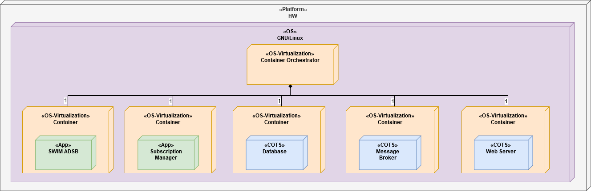
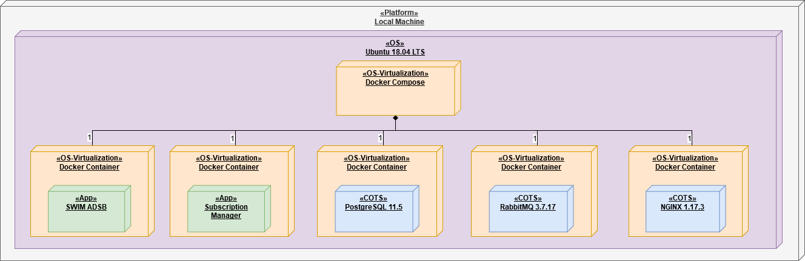
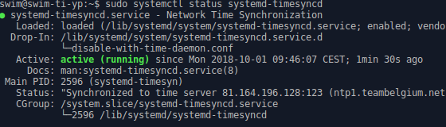
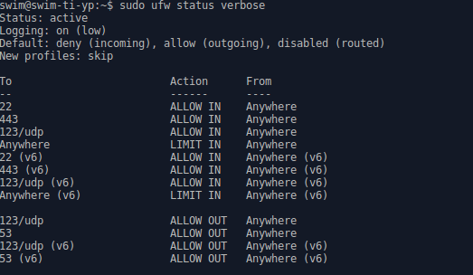

# SWIM Integrator: Conformance Description

## Purpose

This document provides a conformance description of the SWIM TI Integrator\. For each requirement of the SWIM TI Yellow Profile Specification satisfied by the SWIM TI Integrator a conformance description is given\. 

The given conformance descriptions are chosen for illustrative purposes, using minimal implementations and out of the box solutions. Where possible we have opted to provide evidence in the form of configuration or code as it results in the most illustrative approach on how a requirement was achieved\. Alternative ways of demonstrating conformance are possible; implementers are free to choose the verification method and evidence that best suits their implementation\.

## Implementation Description

The SWIM TI Integrator consume a number of services using Yellow Profile and non\-Yellow Profile Service Bindings and is able to transform, correlate and integrate the different data sources in a consistent data flow that can be consumed through a SWIM TI Yellow Profile Service Binding.

### Implementation Layers

We have organized the implementation description in layers to structure the different elements responsible for the satisfaction of a requirement\. This separation in layers helps understand the level or levels at which a requirement is implemented\. For example, overload protection mechanisms may be implemented at any of the following levels or combinations of them:

- Platform: As physical protection at the network level \(e\.g\. router\)\.
- Operating System: Using an Operating System firewall\.
- COTS: Configuration of rate limits in a web server or broker\.
- App: Configurable consumer limits in the application code\.

By introducing the aforementioned layers we can more explicitly detail where and how is the requirement being satisfied\.

#### Platform Layer

Layer consisting of the physical resources \(e\.g\. computing, networking, memory, storage…\) that serve as underlying infrastructure on top of which the rest of the implementation is built\.

##### Description
**TODO**

#### Operating System Layer

Layer of the base Operating System; including its kernel, system software and libraries\. 

##### Description

__Distribution__

|Operating System|Base Image Hash|  
|----------------|---------------|  
|Xubuntu 18\.04 LTS \(AMD64\)|sha256:7c24318d3b1de1efd584b5aea034ce1aafd2d0f06c59812d989a5fc95bf947e3|  


__Relevant System Software and Libraries__

|Software Package|Rationale|Related Requirements|  
|----------------|---------|--------------------|  
|systemd\-timesyncd|Common Time Reference|SWIM\-TIYP\-0053|  
|openssh\-server|Encrypted Connections for Remote Administrative Access|SWIM\-TIYP\-0055, SWIM\-TIYP\-0068|  
|iptables|Overload Protection|SWIM\-TIYP\-0054|  
|ufw|Firewall configuration|SWIM\-TIYP\-0054|  
|fail2ban|Access Control Restriction|SWIM\-TIYP\-0069|  


#### OS\-Virtualization Layer

Layer corresponding to OS\-virtualization software that provides user\-space isolation mechanisms on top of the Operating System’s kernel \(e\.g\. Docker containers\)\.

##### Description

The implementation utilizes Docker containers to provide user\-space isolation between different deployed components and relies on Docker\-Compose for orchestrating their deployment\.

|Software Package|Version|Source Repository|Rationale|  
|----------------|-------|-----------------|---------|  
|Docker|18\.09\.7|APT Source: bionic/universe|Containerization|  
|Docker\-Compose|1\.17\.1|APT Source: bionic/universe|Container Orchestration|  


#### COTS Domain

Layer consisting of the applications part of the implementation that are \(commercially\) available off\-the\-shelf instead of being part of a custom development\. Elements of this layer can be deployed directly on top of the Operating System or through the OS\-virtualization layer\.

##### Description

|Software Package|Version|Base Image Hash|Rationale|Related Bindings|Source Repository|  
|----------------|-------|---------------|---------|----------------|-----------------|  
|nginx|1\.17\.3|sha256:55e7a6f2bb43e38cc34285af03b4973d61f523d26cd8a57e9d00cf4154792d20|Web Server|WS Light| [NGINX](https://github.com/eurocontrol-swim/deploy/blob/master/services/web_server/nginx/) |  
|rabbitMQ|3\.7\.17|sha256:f2b4cae06fcd2518d5058c627c11bd57da11786597125006566d4b896be20a87|Broker|AMQP Messaging| [RabbitMQ](https://github.com/eurocontrol-swim/deploy/blob/master/services/broker/rabbitmq/) |  
|postgreSQL|11\.5|sha256:2c22778e4f1f20f4f581bdb9978948539d09360e77aac94e4a730f03d04e509a|Database|Not Applicable| [PostgreSQL](https://bitbucket\.org/antavelos\-eurocontrol/deploy/blob/master/services/db/postgres/) |  


#### App Layer

Layer consisting of the applications part of the implementation that are a custom development\. Elements of this layer can be deployed directly on top of the Operating System or through an OS\-virtualization layer\.

##### Description

|Application Module|Rationale|Source Repository|  
|------------------|---------|-----------------|  
|Subscription Manager|Subscription Manager is an application that allows Consumers of the SWIM\-TI Integrator to manage their subscriptions and get information on available topics through a REST API over the WS\-Light Service Binding\.| [Subscription Manager](https://github.com/eurocontrol-swim/subscription-manager/blob/master/) |  
|SWIM ADSB|SWIM ADSB is an application that retrieves live air traffic information from [OpenSky Network](https://opensky-network.org) and demonstrates how it can use the [SWIM-PubSub](https://github.com/eurocontrol-swim/swim-pubsub) mini framework in order to publish this information through a broker\.| [SWIM ADSB](https://github.com/eurocontrol-swim/swim-adsb/blob/master/) |  


### Implementation Views

This section provides various architectural views to aid the reader piece together the different elements described above and their interactions.

#### Service View

The SWIM TI Integrator consumes the following services:

- OpenSky Network REST Service

The SWIM TI Integrator provides the following service:

- Live Flight Data Service

The following diagram depicts these services as they are respectively consumed or provided, we have included a reference to the Message Exchange Pattern associated with each service and used yellow lines for those services that conform to the SWIM TI Yellow Profile Service Interface Bindings\.



#### Component and Interface View

The following diagram provides a Component and Interface decomposition of the SWIM TI Integrator and SWIM TI Viewer\.



The external interfaces of the SWIM TI Integrator that satisfy the Yellow Profile Specification are highlighted in yellow color\. 

Internal interfaces are not required to conform to Service Interface Binding requirements of the SWIM TI Yellow Profile, as they are internal details of implementation\. Nevertheless, some of them happen to use the same Yellow Profile Service Interface Bindings and we have indicated so between parentheses\.

#### Deployment View and Implementation Layers

The following figure depicts a deployment view and the traceability to implementation layers introduced in section 2\.1\.



##### Deployment Instance View

The previous deployment diagram has been instantiated with a particular choice of technical solutions that are documented in the following deployment instance diagram:



## SWIM TI Yellow Profile Conformance

### Interface Bindings

#### Service Bindings

#### WS Light

##### HTTP Reason Phrase Header

|Identifier|SWIM\-TIYP\-0044|  
|----------|--------------|  
|Title|HTTP Reason Phrase Header|  
|Statement|The Service Interface Binding **shall** be able to use the HTTP Reason\-Phrase header\.|  
|Clarification|This requirement specifies the need to use of the Reason\-Phrase header of HTTP\. The Reason\-Phrase rules and semantics are defined as part of the HTTP/1\.1 specification\. \+ IETF RFC 7230 \(HTTP/1\.1\): https://tools.ietf.org/html/rfc7230 Related NIST SP 800\-53 rev4 Security Control: CM\-6\.|  
|Verification|Test, Demonstration, Configuration Inspection|  


###### App Layer

 
**Verification Method:** Configuration Inspection  
**Verification Description:** The HTTP Reason Phrase of each possible response of the Subscription Management API is documented in its [OpenAPI Specification](https://github.com/eurocontrol-swim/subscription-manager/blob/master/subscription_manager/openapi.yml).
Sample code snippet:
```
        '200':
          description: the user is authenticated
        '401':
          description: the user is not authenticated
```


##### HTTP Status Code Header

|Identifier|SWIM\-TIYP\-0043|  
|----------|--------------|  
|Title|HTTP Status Code Header|  
|Statement|The Service Interface Binding **shall** be able to use the HTTP Status\-Code header\.|  
|Clarification|This requirement specifies the need to use the Status\-Code header of HTTP\. The Status\-Code rules and semantics are defined as part of the HTTP/1\.1 specification\. \+ IETF RFC 7231 \(HTTP/1\.1\): https://tools.ietf.org/html/rfc7231#section-6 Related NIST SP 800\-53 rev4 Security Control: CM\-6\.|  
|Verification|Test, Demonstration, Configuration Inspection|  


###### App Layer

**Verification Method:** Configuration Inspection  
**Verification Description:** The HTTP Status Code of each possible response of the Subscription Management API is document in its [OpenAPI Specification](https://github.com/eurocontrol-swim/subscription-manager/blob/master/subscription_manager/openapi.yml).

Sample code snippet:
```
        '200':
          description: the user is authenticated
        '401':
          description: the user is not authenticated
```

##### TLS Authentication

|Identifier|SWIM\-TIYP\-0042|  
|----------|--------------|  
|Title|TLS Authentication|  
|Statement|The Service Interface Binding **shall** support one of the following authentication mechanisms for TLS:  \+ Mutual authentication with X\.509 certificates \+ Server authentication with X\.509 and Client authentication with HTTP Basic or HTTP Digest\.|  
|Clarification|This requirement specifies the supported TLS authentication methods\. Related NIST SP 800\-53 rev4 Security Control: IA\-2, IA\-8, IA\-9, SC\-17\.|  
|Verification|Test, Demonstration, Configuration Inspection|  


###### COTS Layer


**Verification Method:** Configuration Inspection  
**Verification Description:** The Web Server is configured to provide Server Authentication with X\.509 certificates as shown in the following configuration snippet\.   
```
server {
  listen 443 ssl;
  listen [::]:443 ssl;
  server_name localhost;

  ssl_certificate     /etc/nginx/ssl/server_certificate.pem;
  ssl_certificate_key /etc/nginx/ssl/server_key.pem;
```
Which can be found in the [nginx.conf](https://github.com/eurocontrol-swim/deploy/blob/master/services/web_server/nginx/conf.d/nginx.conf) configuration file.


###### App Layer


**Verification Method:** Configuration Inspection  
**Verification Description:** The Subscription Management API authenticates users with HTTP Basic Username/Password as detailed in its [OpenAPI Specification](https://github.com/eurocontrol-swim/subscription-manager/blob/master/subscription_manager/openapi.yml).  

Code snippet:
```
security:
  - basicAuth: []
```

##### HTTP Header Transfer Encoding

|Identifier|SWIM\-TIYP\-0039|  
|----------|--------------|  
|Title|HTTP Header Transfer Encoding|  
|Statement|The Service Interface Binding may use the following values of the HTTP header Transfer\-Encoding: \+ chunked|  
|Clarification|The sender of a message may not know in advance the length of the message that will be sent\. The HTTP/1\.1 protocol provides for the mechanism to send the payload chunked, a Service Provider can opt to use this capability\. \+ IETF RFC 7230 \(HTTP/1\.1\): https://tools.ietf.org/html/rfc7230#section-3.3.1 Related NIST SP 800\-53 rev4 Security Control: CM\-6\.|  
|Verification|Test, Demonstration, Configuration Inspection|  


###### App Layer


**Verification Method:** Not Applicable  
**Verification Description:** Transfer Encoding is not used in the implementation.  


##### HTTP Compression and Content Encoding Header

|Identifier|SWIM\-TIYP\-0038|  
|----------|--------------|  
|Title|HTTP Compression and Content Encoding Header|  
|Statement|The Service Interface Binding **shall** use one of the following values of the HTTP header Content\-Encoding if data compression is needed: \+ deflate \+ gzip \+ exi|  
|Clarification|This requirement is applicable when data compression is used, in such case it restricts the possible compression algorithms and requires the use of the HTTP Content\-Encoding header\. HTTP compression performs on the fly compression\. The compression can only be requested by the client\. The server can ignore the request by the client and return non\-compressed data if deemed appropriate\. \+ DEFLATE Compressed Data Format Specification version 1\.3: https://www.ietf.org/rfc/rfc1951.txt \+ GZIP File Format Specification 4\.3: https://tools.ietf.org/html/rfc1952 \+ Efficient XML Interchange \(EXI\) Format 1\.0: http://www.w3.org/TR/2014/REC-exi-20140211/ Related NIST SP 800\-53 rev4 Security Control: CM\-6\.|  
|Verification|Test, Demonstration, Configuration Inspection|  


###### App Layer


**Verification Method:** Not Applicable  
**Verification Description:** The Subscription Management API doesn’t make use of data compression and thus doesn’t require the use of Content\-Encoding header\.  


##### HTTP Content Type Header

|Identifier|SWIM\-TIYP\-0033|  
|----------|--------------|  
|Title|HTTP Content Type Header|  
|Statement|The Service Interface Binding **shall** use the HTTP Content\-Type header to specify the Media Type of the payload body when the payload body is present\.|  
|Clarification|This requirement specifies further the use of the Content\-Type header of HTTP allowed in the HTTP/1\.1 specification\. Possible values include: \+ IANA registered Media Types \+ Protocol specific extensions \+ Vendor proprietary extensions\. IANA registered Media Types:  Related NIST SP 800\-53 rev4 Security Control: CM\-6\.|  
|Verification|Test, Demonstration, Configuration Inspection|  


###### App Layer


**Verification Method:** Configuration Inspection  
**Verification Description:** The HTTP Content-Type of each possible response of the Subscription Management API is document in its [OpenAPI Specification](https://github.com/eurocontrol-swim/subscription-manager/blob/master/subscription_manager/openapi.yml).  

Sample code snippet:
```
  /topics/own:
    get:
      tags:
        - topics
      summary: retrieves all available topics of the logged in user
      operationId: subscription_manager.endpoints.topics.get_topics_own
      responses:
        '200':
          description: lists all available topics of the logged in user
          content:
            application/json:
              schema:
                type: array
                items:
                  $ref: '#/components/schemas/Topic'
```


##### HTTP over TLS

|Identifier|SWIM\-TIYP\-0010|  
|----------|--------------|  
|Title|HTTP over TLS|  
|Statement|The Service Interface Binding **shall** comply with IETF RFC 2818 \(HTTP over TLS\)\.|  
|Clarification|This requirement mandates compliance with the interoperability standard for the use of HTTP over TLS \(HTTPS\)\. \+ IETF RFC 2818 \(HTTP over TLS\): http://tools.ietf.org/html/rfc2818 Related NIST SP 800\-53 rev4 Security Control: SC\-8\.|  
|Verification|Test, Demonstration, Configuration Inspection|  


###### COTS Layer


**Verification Method:** Configuration Inspection  
**Verification Description:** The Web Server is configured to use HTTP 1\.1 over TLS \(named SSL for legacy reasons\)\. Furthermore, non\-protected traffic \(HTTP\) is redirected to protected traffic \(HTTPS\)\. The following snippet shows the relevant parts of the [configuration file](https://github.com/eurocontrol-swim/deploy/blob/master/services/web_server/nginx/conf.d/nginx.conf):

```
# redirect all http traffic to https
server {
  listen 80 default_server;
  listen [::]:80 default_server;
  server_name localhost;
  return 301 https://$host$request_uri;
}

server {
  listen 443 ssl;
  listen [::]:443 ssl;
  server_name localhost;

  ssl_certificate     /etc/nginx/ssl/server_certificate.pem;
  ssl_certificate_key /etc/nginx/ssl/server_key.pem;
```  


##### HTTP

|Identifier|SWIM\-TIYP\-0009|  
|----------|--------------|  
|Title|HTTP|  
|Statement|The Service Interface Binding **shall** support HTTP/1\.1\.|  
|Clarification|This requirement specifies the use of the HTTP/1\.1 protocol\. HTTP/1\.1 is defined across 7 IETF RFCs spanning from RFC 7230 to RFC 7237\.  \+ IETF RFC 7230:  \+ IETF RFC 7231:  \+ IETF RFC 7232: http://tools.ietf.org/html/rfc7232 \+ IETF RFC 7233: http://tools.ietf.org/html/rfc72313 \+ IETF RFC 7234: http://tools.ietf.org/html/rfc72314 \+ IETF RFC 7235:  \+ IETF RFC 7236: http://tools.ietf.org/html/rfc72316 \+ IETF RFC 7237: http://tools.ietf.org/html/rfc7237|  
|Verification|Test, Demonstration, Configuration Inspection|  


###### COTS Layer


**Verification Method:** Configuration Inspection  
**Verification Description:** Nginx answers with the highest version of HTTP supported\. The server is configured to **not** use HTTP 2\.0, which results in HTTP 1\.1 being the highest version\. The following snippet shows the relevant parts of the [configuration file](https://github.com/eurocontrol-swim/deploy/blob/master/services/web_server/nginx/conf.d/nginx.conf):

```
# redirect all http traffic to https
server {
  listen 80 default_server;
  listen [::]:80 default_server;
  server_name localhost;
  return 301 https://$host$request_uri;
}

server {
  listen 443 ssl;
  listen [::]:443 ssl;
  server_name localhost;

  ssl_certificate     /etc/nginx/ssl/server_certificate.pem;
  ssl_certificate_key /etc/nginx/ssl/server_key.pem;
```  
 


##### TLS

|Identifier|SWIM\-TIYP\-0008|  
|----------|--------------|  
|Title|TLS|  
|Statement|The Service Interface Binding **shall** support the following versions of the Transport Layer Security Protocol \(TLS\): \+ IETF RFC 5246 \(TLS v1\.2\)|  
|Clarification|TLS is a widespread protocol to secure communications at the transport layer\. \+ IETF RFC 5246 \(TLS v1\.2\): http://tools.ietf.org/html/rfc5246 Related NIST SP 800\-53 rev4 Security Control: SC\-8\.|  
|Verification|Test, Demonstration, Configuration Inspection|  


###### COTS Layer


**Verification Method:** Configuration Inspection  
**Verification Description:** The Web Server is configured to disable other versions of TLS or SSL that are not TLS1\.2\. The following snippet shows the relevant parts of the [configuration file](https://github.com/eurocontrol-swim/deploy/blob/master/services/web_server/nginx/conf.d/nginx.conf):

```
  # disable SSLv3, TLS 1.0 and TLS 1.1
  ssl_protocols TLSv1.2;
```  


#### AMQP Messaging

##### AMQP Content Encoding Header

|Identifier|SWIM\-TIYP\-0049|  
|----------|--------------|  
|Title|AMQP Content Encoding Header|  
|Statement|The Service Interface Binding may use Media Type values in the AMQP 1\.0 content\-encoding header to specify additional content encodings applied to the body\.|  
|Clarification|This requirement specifies the possible use of the content\-encoding header of AMQP 1\.0 to detail additional encoding applied over the application\-data section \(e\.g\. compression\)\. Possible values include:  \+ IANA registered Content Coding Media Types \+ Protocol specific extensions \+ Vendor proprietary extensions\. IANA registered Content Coding Media Types: https://www.iana.org/assignments/http-parameters/http-parameters.xml#content-coding  Related NIST SP 800\-53 rev4 Security Control: CM\-6\.|  
|Verification|Test|  


###### App Layer


**Verification Method:** Not Applicable  
**Verification Description:** The SWIM ADSB produces AMQP 1\.0 messages and allows to set the appropriate content\-encoding for the message\. Nevertheless, no compressed messages are sent over AMQP 1\.0\.  


##### AMQP Content Type Header

|Identifier|SWIM\-TIYP\-0048|  
|----------|--------------|  
|Title|AMQP Content Type Header|  
|Statement|The Service Interface Binding **shall** use the AMQP 1\.0 content\-type header to specify Media Type values when the body is composed of data sections\.|  
|Clarification|This requirement specifies the use of the content\-type header of AMQP 1\.0\. Possible values include:  \+ IANA registered Media Types \+ Protocol specific extensions \+ Vendor proprietary extensions\. IANA registered Media Types:  Related NIST SP 800\-53 rev4 Security Control: CM\-6\.|  
|Verification|Test|  


###### App Layer


**Verification Method:** Configuration Inspection  
**Verification Description:** The SWIM ADSB produces AMQP 1\.0 messages and sets the appropriate content\-type for the message\. The following snippet shows how this is done:

```
    def departures_handler(self, airport: str, topic_group_data: Optional[Dict[str, StateVector]] = None) -> Message:
        """
        Is the callback that will be used to the departure related topics
        """
        data = self._flight_connection_handler(airport,
                                               states_dict=topic_group_data,
                                               get_flight_connections_handler=self._departures_today_handler)

        return Message(body=json.dumps(data), content_type='application/json')
```  


##### AMQP Transport Security Authentication

|Identifier|SWIM\-TIYP\-0037|  
|----------|--------------|  
|Title|AMQP Transport Security Authentication|  
|Statement|The Service Interface Binding **shall** support at least one of the following authentication methods:  \+ TLS server authentication and SASL PLAIN \+ TLS mutual authentication and SASL ANONYMOUS \+ TLS mutual authentication and SASL PLAIN\.|  
|Clarification|This requirement specifies the supported authentication methods of the AMQP 1\.0 Service Interface Binding\. Related NIST SP 800\-53 rev4 Security Control: IA\-2, IA\-8, IA\-9, SC\-17\.|  
|Verification|Test, Demonstration, Configuration Inspection|  


######  COTS Layer


**Verification Method:** Configuration Inspection  
**Verification Description:** 
+ TLS Server Authentication: To enable TLS server authentication the server must be configured with a X\.509 certificate and private key and the certificate of the Root CA\. This is done in the configuration file [rabbitmq\.conf](https://github.com/eurocontrol-swim/deploy/blob/master/services/broker/rabbitmq/rabbitmq.conf
), as shown in the following configuration snippet: 
```
ssl_options.verify               = verify_peer
ssl_options.fail_if_no_peer_cert = false
ssl_options.cacertfile           = /certs/ca_certificate.pem
ssl_options.certfile             = /certs/server_certificate.pem
ssl_options.keyfile              = /certs/server_key.pem
```

+ TLS Mutual Authentication: To use TLS mutual authentication we have to allow the clients to authenticate themselves by means of a X\.509 certificate\. The following snippet from the [rabbitmq\.conf](https://github.com/eurocontrol-swim/deploy/blob/master/services/broker/rabbitmq/rabbitmq.conf
) explains how this is achieved.   
```
## The rabbitmq-auth-mechanism-ssl plugin makes it possible to
## authenticate a user based on the client's x509 (TLS) certificate.
## Related doc guide: https://rabbitmq.com/authentication.html.
##
## To use auth-mechanism-ssl, the EXTERNAL mechanism should
## be enabled:
##
auth_mechanisms.1 = EXTERNAL
# auth_mechanisms.2 = AMQPLAIN
auth_mechanisms.2 = PLAIN
```
The auth\-mechanism\-ssl plugin is activated executing rabbitmq\-plugins in the command line as shown in the [Dockerfile]() : 

```
RUN rabbitmq-plugins enable --offline rabbitmq_amqp1_0 rabbitmq_auth_mechanism_ssl
```

+ SASL Plain: The broker accepts connections using SASL Plain mode \(User/password authentication\)\.    
```
## The rabbitmq-auth-mechanism-ssl plugin makes it possible to
## authenticate a user based on the client's x509 (TLS) certificate.
## Related doc guide: https://rabbitmq.com/authentication.html.
##
## To use auth-mechanism-ssl, the EXTERNAL mechanism should
## be enabled:
##
auth_mechanisms.1 = EXTERNAL
# auth_mechanisms.2 = AMQPLAIN
auth_mechanisms.2 = PLAIN
``` 


###### App Layer


**Verification Method:** Configuration Inspection  
**Verification Description:** 
+ TLS Server Authentication: To enable TLS server authentication for the clients \(SWIM ADSB and SWIM Explorer\) we must configure the root CA certificate in order to verify the public certificate presented by the server\. This is done through their [configuration](https://github.com/eurocontrol-swim/swim-adsb/blob/master/swim_adsb/config.yml) [files](https://github.com/eurocontrol-swim/swim-adsb/blob/master/swim_explorer/config.yml) using the cert\_db parameter:     
```
BROKER:
  host: '0.0.0.0:5671'
  cert_db: '/secrets/rabbitmq/ca_certificate.pem'
  cert_file: '/secrets/rabbitmq/client_certificate.pem'
  cert_key: '/secrets/rabbitmq/client_key.pem'
```

+ TLS Mutual Authentication: To enable TLS client Mutual Authentication, besides configuring TLS Server Authentication like previously shown the clients must also present their particular public key certificates\. This is done via the cert\_file and cert\_key and cert\_password \(if the private key is encrypted\)\ shown in the snippet above.      

+ SASL Plain: No clients are configured to use SASL PLAIN in the deployment, nevertheless external consumers can be configured to authenticate using SASL PLAIN as the broker accepts SASL PLAIN authentication\.  


##### SASL

|Identifier|SWIM\-TIYP\-0051|  
|----------|--------------|  
|Title|SASL|  
|Statement|The Service Interface Binding **shall** support Simple Authentication and Security Layer \(SASL\)\.|  
|Clarification|This requirement specifies the support of SASL authentication mechanism \(RFC 4422\) for the AMQP Service Binding\. The framing of the SASL protocol inside AMQP 1\.0 is defined in the AMQP 1\.0 Specification \(section 5\)\. \+ Simple Authentication and Security Layer \(SASL\):  Related NIST SP 800\-53 rev4 Security Control: IA\-2, IA\-8, IA\-9\.|  
|Verification|Test, Demonstration, Configuration Inspection|  


###### COTS Layer


**Verification Method:** Configuration Inspection  
**Verification Description:** The broker accepts connections using SASL Plain mode \(User/password authentication\)\.    
```
## The rabbitmq-auth-mechanism-ssl plugin makes it possible to
## authenticate a user based on the client's x509 (TLS) certificate.
## Related doc guide: https://rabbitmq.com/authentication.html.
##
## To use auth-mechanism-ssl, the EXTERNAL mechanism should
## be enabled:
##
auth_mechanisms.1 = EXTERNAL
# auth_mechanisms.2 = AMQPLAIN
auth_mechanisms.2 = PLAIN
```


###### App Layer


**Verification Method:** Configuration Inspection  
**Verification Description:** Although there is no use being made of SASL authentication the client library used \(Qpid Proton\) does support SASL authentication provided that the necessary dependencies are installed as indicated in its [documentation](https://github.com/apache/qpid-proton/blob/master/INSTALL.md).


##### AMQP over TLS

|Identifier|SWIM\-TIYP\-0052|  
|----------|--------------|  
|Title|AMQP over TLS|  
|Statement|The Service Interface Binding **shall** use the AMQP over TLS \(amqps\) for transport security\.|  
|Clarification|This requirement mandates the establishment of a TLS session prior to the exchange of AMQP headers as defined in the AMQP 1\.0 specification, section 5\.2\.1\. This mechanism of establishing the transport secure layer is denominated amqps by IANA\. \+ ISO/IEC 19464:2014 Information technology \-\- Advanced Message Queuing Protocol \(AMQP\) v1\.0 specification: http://www.iso.org/iso/home/store/catalogue_tc/catalogue_detail.htm?csnumber=64955 Related NIST SP 800\-53 rev4 Security Control: SC\-8\.|  
|Verification|Test, Demonstration, Configuration Inspection|  


###### COTS Layer


**Verification Method:** Configuration Inspection  
**Verification Description:** RabbitMQ accepts AMQP over TLS \(AMQPS\) connections over the standard port assigned by IANA \(5671\)\. This port can, nonetheless, be set in the configuration file [rabbitmq\.conf](https://github.com/eurocontrol-swim/deploy/blob/master/services/broker/rabbitmq/rabbitmq.conf) as shown here:  

```
listeners.ssl.default = 5671
``` 


##### AMQP

|Identifier|SWIM\-TIYP\-0036|  
|----------|--------------|  
|Title|AMQP|  
|Statement|The Service Interface Binding **shall** support the Advanced Message Queuing Protocol \(AMQP\) 1\.0\.|  
|Clarification|The Advanced Message Queuing Protocol \(AMQP\) 1\.0 is an open internet protocol for business messaging\. It defines a binary wire\-level protocol that allows for the reliable exchange of business messages between two parties\. \+ ISO/IEC 19464:2014 Information technology \-\- Advanced Message Queuing Protocol \(AMQP\) v1\.0 specification: http://www.iso.org/iso/home/store/catalogue_tc/catalogue_detail.htm?csnumber=64955|  
|Verification|Test, Demonstration, Configuration Inspection|  


###### COTS Layer


**Verification Method:** Configuration Inspection  
**Verification Description:** RabbitMQ supports AMQP 1\.0 protocol through a plugin\. The plugin must be enabled as otherwise RabbitMQ defaults to AMQP 0\.9\.1\. Enabling this plugging is done with the rabbitmq\-plugins command line application before running the broker, as shown in the broker [Dockerfile](https://github.com/eurocontrol-swim/deploy/blob/master/services/broker/rabbitmq/Dockerfile):  
```
FROM rabbitmq:3-management

RUN apt-get update && apt-get install -y curl

RUN rabbitmq-plugins enable --offline rabbitmq_amqp1_0 rabbitmq_auth_mechanism_ssl
``` 


###### App Layer


**Verification Method:** Configuration Inspection  
**Verification Description:** The SWIM PubSub framework relies on Apache Qpid Proton as its AMQP 1\.0 client\. As shown in the [SWIM base Dockerfile](https://github.com/eurocontrol-swim/deploy/blob/master/services/base/Dockerfile)
from which SWIM ADSB and SWIM Explorer are based.
```
RUN apt-get install gcc g++ cmake cmake-curses-gui uuid-dev \
    libssl-dev libsasl2-2 libsasl2-dev libsasl2-modules swig \
    python3 python3-dev python3-pip ruby-dev python3-qpid-proton \
    build-essential vim tree netcat pkg-config openssl libssl-dev \
    libffi-dev python-gevent gunicorn git -y
```   


##### TLS

|Identifier|SWIM\-TIYP\-0008|  
|----------|--------------|  
|Title|TLS|  
|Statement|The Service Interface Binding **shall** support the following versions of the Transport Layer Security Protocol \(TLS\): \+ IETF RFC 5246 \(TLS v1\.2\)|  
|Clarification|TLS is a widespread protocol to secure communications at the transport layer\. \+ IETF RFC 5246 \(TLS v1\.2\): http://tools.ietf.org/html/rfc5246 Related NIST SP 800\-53 rev4 Security Control: SC\-8\.|  
|Verification|Test, Demonstration, Configuration Inspection|  


###### COTS Layer


**Verification Method:** Configuration Inspection  
**Verification Description:** The broker is [configured](https://github.com/eurocontrol-swim/deploy/blob/master/services/broker/rabbitmq/rabbitmq.conf) to use TLS 1\.2 as shown in the following configuration snippet:  
```
## Limit TLS versions to TLS 1.2
ssl_options.versions.1 = tlsv1.2
```
Furthermore some strict controls to the TLS negotiation are applied:  
```
ssl_options.honor_cipher_order   = true
ssl_options.honor_ecc_order      = true
ssl_options.client_renegotiation = false
ssl_options.secure_renegotiate   = true
```


###### App Layer


**Verification Method:** Configuration Inspection  
**Verification Description:** The AMQP clients of the deployment environment \(SWIM ADSB and SWIM Explorer\) are configured to be able to use TLS, the version is mandated by the broker which is configured to use TLS1\.2\.  


### Network Bindings

## Infrastructure Capabilities

### Mandatory Requirements

#### Common Time Reference

|Identifier|SWIM\-TIYP\-0053|  
|----------|--------------|  
|Title|Common Time Reference|  
|Statement|The SWIM\-TI **shall** rely on a Common Time Reference \(CTR\) for time synchronisation\.|  
|Clarification|For the SWIM environment, each SWIM\-TI function that uses time information must be synchronised to a time reference that satisfies precision requirements \(e\.g\. a geographically close Stratum 2 or Stratum 1 time server\)\. For instance, security and identity tokens are checked for freshness in order to ensure that they are still within their valid lifetimes\. Related NIST SP 800\-53 rev4 Security Control: AU\-8 \(1\)\.|  
|Verification|Test, Demonstration|  


##### Operating System Layer


**Verification Method:** Demonstration  
**Verification Description:** The system is configured to use the NTP protocol for time synchronisation\. Invoking the following command in the command line terminal: 
```
$ systemctl status systemd-timesyncd
```
Results in the following output in the implementation environment:  


Which shows the SWIM\-TI YP is synchronized via NTP with a Stratum 2 server\.  


#### Overload Protection

|Identifier|SWIM\-TIYP\-0054|  
|----------|--------------|  
|Title|Overload Protection|  
|Statement|The SWIM\-TI **shall** provide overload protection mechanisms for its provided services\.|  
|Clarification|This requirement prevents a single consumer from using all available resources, allowing other consumers requests to be processed\.  Due to the broad scope of uses applicable to the SWIM\-TI Yellow Profile there is no single mechanism that can fit all implementations\. Implementers are required to have some form of overload protection, the details of which are not specified to accommodate the different use cases\.  Common examples of such protection mechanisms include \(from easier to implement to more sophisticated mechanisms\): \+ Limitation of the total number of requests each Service Consumer may be able to consume in certain time window \+ Software firewalls \+ Hardware solutions like routers and firewalls  Related NIST SP 800\-53 rev4 Security Control: SC\-5\.|  
|Verification|Test, Analysis|  


##### Operating System Layer


**Verification Method:** Configuration Inspection  
**Verification Description:** The system is configured with a software firewall with rate limiting rules\. The status of the firewall as well as the applied rules can be obtained with the following command: 
```
$ sudo ufw status verbose
```
Which produces the following output on the implementation environment:  


In particular, there is a rule imposing limits to all incoming traffic\.


##### COTS Layer

**Verification Method:** Configuration Inspection  
**Verification Description:** NGINX is [configured](https://github.com/eurocontrol-swim/deploy/blob/master/services/web_server/nginx/conf.d/nginx.conf) with request limitations as an overload protection mechanism for the application. The following excerpt shows how the limitation zone is defined allowing 1 request/second per IP address:

```
limit_req_zone $binary_remote_addr zone=one:10m rate=1r/s;
```

This limitation is applied to all endpoints of the Web Server and allows a burst of up to 5 requests as shown in the following excerpt.

```
  limit_req zone=one burst=5;
```

**Verification Method:** Configuration Inspection  
**Verification Description:** RabbitMQ is [configured](https://github.com/eurocontrol-swim/deploy/blob/master/services/subscription_manager/provision/config.yml) with a maximum number messages allowed in the queues which protects the broker from memory overload.
```
MAX_BROKER_QUEUE_LENGTH: 100
```

This is applied as a [policy](https://www.rabbitmq.com/parameters.html) to RabbitMQ by the [Subscription Manager](https://github.com/eurocontrol-swim/subscription-manager/blob/master/provision/provision_broker.py)

```
def _apply_policies():
    try:
        client.create_policy(
            name='max-queue-length',
            pattern=".*",
            priority=1,
            apply_to="queues",
            definitions={'max-length': config['MAX_BROKER_QUEUE_LENGTH']}
        )
        _logger.info(f"Policy 'max-queue-length' was successfully applied in RabbitMQ")
    except APIError as e:
        _logger.error(f'Error while applying policy to RabbitMQ: {str(e)}')
```


#### Encrypted Connections for Remote Administrative Access

|Identifier|SWIM\-TIYP\-0055|  
|----------|--------------|  
|Title|Encrypted Connections for Remote Administrative Access|  
|Statement|The SWIM\-TI **shall** use an encrypted connection if remote access to its administrative functionality is needed\.|  
|Clarification|Remote connections from external networks \(e\.g\. the Internet\) might pose a security risk\. This requirement ensures certain security controls such as using an encrypted virtual private network \(VPN\) and/or transport secured connections are present\. Related NIST SP 800\-53 rev4 Security Control: AC\-17, AC\-17 \(2\)\.|  
|Verification|Demonstration, Configuration Inspection|  


##### Operating System Layer


**Verification Method:** Configuration Inspection  
**Verification Description:** Remote administrative functionality is performed via SSH which provides end\-to\-end encryption\.  
<<paste SSH configuration>>   


##### COTS Layer


**Verification Method:** Configuration Inspection  
**Verification Description:** The interface for remote management of RabbitMQ is set over HTTPS with X\.509 server authentication and User/Password authentication for the admin\. As can be seen in [rabbitmq.conf](https://github.com/eurocontrol-swim/deploy/blob/master/services/broker/rabbitmq/rabbitmq.conf) configuration file.
```
## HTTPS listener settings.
## See https://rabbitmq.com/management.html and https://rabbitmq.com/ssl.html for details.
##
management.ssl.port       = 15671
management.ssl.cacertfile = /certs/ca_certificate.pem
management.ssl.certfile   = /certs/server_certificate.pem
management.ssl.keyfile    = /certs/server_key.pem
```  


#### Obscure Password Typing

|Identifier|SWIM\-TIYP\-0056|  
|----------|--------------|  
|Title|Obscure Password Typing|  
|Statement|The SWIM\-TI **shall** obscure screen typing feedback of passwords\.|  
|Clarification|This requirement ensures that the feedback from information systems does not provide information that would allow unauthorized individuals to compromise authentication mechanisms\.  This requirement prevents the threat often referred to as shoulder surfing, if the threat is not present \(e\.g\. the system does not rely on passwords for authentication\) or the risk is mitigated in other ways \(e\.g\. physical security restrictions prevent shoulder surfing\) the requirement can be considered satisfied\. Related NIST SP 800\-53 rev4 Security Control: IA\-6\.|  
|Verification|Demonstration|  


##### Operating System Layer


**Verification Method:** Demonstration  
**Verification Description:** Local administrative functionality requiring password is obscured by the system’s command line interface\.  


##### COTS Layer


**Verification Method:** Demonstration  
**Verification Description:** RabbitMQ’s administrative functionality through its Management interface obscures password fields\.  


#### Least Privileged Principle Access

|Identifier|SWIM\-TIYP\-0057|  
|----------|--------------|  
|Title|Least Privileged Principle Access|  
|Statement|The SWIM\-TI **shall** rely on the principle of least privilege to grant access to its resources\.|  
|Clarification|Least privilege principle ensures that users and processes operate using privilege levels not higher than those necessary for the proper execution of their tasks\. The principle of least privilege provides a first layer of mitigation against potential attacks by preventing access to critical functionality to users and processes that do not strictly require it for their normal operation\. Related NIST SP 800\-53 rev4 Security Control: AC\-6, AU\-9\.|  
|Verification|Demonstration, Analysis|  


##### OS\-Virtualization Layer

**Verification Method:** Analysis
**Verification Description:** RabbitMQ's container is [configured](https://github.com/eurocontrol-swim/deploy/blob/master/services/broker/rabbitmq/Dockerfile) to run using the `rabbitmq` user with restricted ownership and permissions as show in the following snippet.

```
USER rabbitmq
```

The resource ownership and permissions can be found in the base RabbitMQ [Dockerfile](https://github.com/docker-library/rabbitmq/blob/master/3.7/ubuntu/Dockerfile):

```
RUN set -eux; \
	groupadd --gid 999 --system rabbitmq; \
	useradd --uid 999 --system --home-dir "$RABBITMQ_DATA_DIR" --gid rabbitmq rabbitmq; \
	mkdir -p "$RABBITMQ_DATA_DIR" /etc/rabbitmq /tmp/rabbitmq-ssl /var/log/rabbitmq; \
	chown -fR rabbitmq:rabbitmq "$RABBITMQ_DATA_DIR" /etc/rabbitmq /tmp/rabbitmq-ssl /var/log/rabbitmq; \
	chmod 777 "$RABBITMQ_DATA_DIR" /etc/rabbitmq /tmp/rabbitmq-ssl /var/log/rabbitmq; \
```

**Verification Method:** Analysis
**Verification Description:** PostgreSQL's container is [configured](https://github.com/eurocontrol-swim/deploy/blob/master/services/db/postgres/Dockerfile) to run using the `postgres` user with restricted ownership and permissions as shown in the following snippet.

```
USER postgres
```

The resource ownership and permissions can be found in the base PostgreSQL [Dockerfile](https://github.com/docker-library/postgres/blob/master/11/Dockerfile):

```
# explicitly set user/group IDs
RUN set -eux; \
	groupadd -r postgres --gid=999; \
# https://salsa.debian.org/postgresql/postgresql-common/blob/997d842ee744687d99a2b2d95c1083a2615c79e8/debian/postgresql-common.postinst#L32-35
	useradd -r -g postgres --uid=999 --home-dir=/var/lib/postgresql --shell=/bin/bash postgres; \
# also create the postgres user's home directory with appropriate permissions
# see https://github.com/docker-library/postgres/issues/274
	mkdir -p /var/lib/postgresql; \
	chown -R postgres:postgres /var/lib/postgresql
```

**Verification Method:** Analysis
**Verification Description:** Subscription Manager's container is [configured](https://github.com/eurocontrol-swim/subscription-manager/blob/master/Dockerfile) to run using the `swim` user with restricted ownership and permissions as shown in the following snippet.

```
RUN groupadd -r swim && useradd --no-log-init -md /home/swim -r -g swim swim

RUN chown -R swim:swim /app

USER swim
```

**Verification Method:** Analysis
**Verification Description:** SWIM ADSB's container is [configured](https://github.com/eurocontrol-swim/subscription-manager/blob/master/Dockerfile) to run using the `swim` user with restricted ownership and permissions as shown in the following snippet.

```
RUN groupadd -r swim && useradd --no-log-init -md /home/swim -r -g swim swim

RUN chown -R swim:swim /app

USER swim
```
<< TODO: Add evidence for NGINX. >>


##### App Layer


**Verification Method:** Analysis  
**Verification Description:** << TODO: Describe permissions and users for the different interfaces >>

#### Automatic Sessions termination

|Identifier|SWIM\-TIYP\-0058|  
|----------|--------------|  
|Title|Automatic Sessions termination|  
|Statement|The SWIM\-TI **shall** terminate network connections associated to a communication session:  \+ At the end of the session or, \+ After a configurable amount of idle time\.|  
|Clarification|Unneeded network connections are a source of potential security breaches, termination of such connections minimizes said risk\. Related NIST SP 800\-53 rev4 Security Control: SC\-10\.|  
|Verification|Test, Configuration Inspection|  


##### Operating System Layer


**Verification Method:** Configuration Inspection  
**Verification Description:** << Idle connection termination can be configured at OS layer with the TCP keep alives:   >>|  


**Verification Method:** Configuration Inspection  
**Verification Description:** << Idle session of ssh can be configured in /etc/ssh/sshd\_config:  >>|  


**Verification Method:** Test  
**Verification Description:** Automatic closing of idle connections can be tested using netcat on an open port\. Step 1: - netcat <host\_address> 22 Step 2: Verify that after an idle period of time the connection is closed\. << paste example>>|  


#### Trusted Software

|Identifier|SWIM\-TIYP\-0059|  
|----------|--------------|  
|Title|Trusted Software|  
|Statement|The SWIM\-TI **shall** be composed of software components whose origin authenticity and integrity can be verified\.|  
|Clarification|This construction requirement guarantees integrity and authenticity of software used for the implementation of SWIM\-TI components\. Examples of mechanisms that can be used to verify the integrity include checksums and hash functions, cryptographic signatures can be used to verify authenticity\. Related NIST SP 800\-53 rev4 Security Control: SI\-7\.|  
|Verification|Configuration Inspection, Test|  


##### OS Layer


**Verification Method:** Analysis  
**Verification Description:** The installed Operating System in the implementation environment is a Xubuntu 18\.04 LTS with hash: `sha256:64c7acf836cfceafabb5adfcb2e4bc67fbf9b4a21b1d10149417b796028c871c` 

All additional software has been installed from the official repositories and their integrity is verified by APT package management system via hashes and public key signatures\. 


##### OS\-Virtualization Layer


**Verification Method:** Analysis  
**Verification Description:** NGINX is deployed based on an official Docker [image](https://hub.docker.com/layers/nginx/library/nginx/1.17.3/images/sha256-55e7a6f2bb43e38cc34285af03b4973d61f523d26cd8a57e9d00cf4154792d20) with the following hash: `sha256:55e7a6f2bb43e38cc34285af03b4973d61f523d26cd8a57e9d00cf4154792d20`  


**Verification Method:** Analysis  
**Verification Description:** PostgreSQL is deployed based on an official Docker [image](https://hub.docker.com/layers/postgres/library/postgres/11.5/images/sha256-2c22778e4f1f20f4f581bdb9978948539d09360e77aac94e4a730f03d04e509a) with the following hash: `sha256:2c22778e4f1f20f4f581bdb9978948539d09360e77aac94e4a730f03d04e509a`    


**Verification Method:** Analysis  
**Verification Description:** RabbitMQ is deployed based on an official Docker [image](https://hub.docker.com/layers/rabbitmq/library/rabbitmq/3.7.17-management/images/sha256-f2b4cae06fcd2518d5058c627c11bd57da11786597125006566d4b896be20a87) with the following hash: `sha256:f2b4cae06fcd2518d5058c627c11bd57da11786597125006566d4b896be20a87`  


##### App Layer

<< TODO: Point to docker repository images when ready. >>

#### Verification of Signed Messages Integrity

|Identifier|SWIM\-TIYP\-0060|  
|----------|--------------|  
|Title|Verification of Signed Messages Integrity|  
|Statement|The SWIM\-TI **shall** verify, prior to any processing or data transformation, the integrity of messages when a message cryptographic signature is used\.|  
|Clarification|Cryptographic message signature is used to verify the integrity of a message\. This requirement ensures that the integrity of a signed message is verified before performing any processing or transformation on the message that could alter its integrity\. Related NIST SP 800\-53 rev4 Security Control: SC\-8\.|  
|Verification|Test, Demonstration|  


##### App Layer


**Verification Method:** Not Applicable  
**Verification Description:** Message level cryptographic signatures are not used with any of the services provided by the TI implementation\. 


#### Message Protocol Validation

|Identifier|SWIM\-TIYP\-0061|  
|----------|--------------|  
|Title|Message Protocol Validation|  
|Statement|The SWIM\-TI **shall** ensure messages are valid against the protocol standards applicable to its Service Interface Bindings\.|  
|Clarification|This requirement ensures information passed through the SWIM\-TI is validated against the different protocol standards composing the Interface Bindings\. Related NIST SP 800\-53 rev4 Security Control: SI\-10\.|  
|Verification|Test, Demonstration, Analysis|  


##### Operating System Layer


**Verification Method:** TBD 
**Verification Description:** << Iptables can check invalid packets up to TCP layer\. To investigate the proper configuration and if it’s desirable to set up\. >>  


##### COTS Layer


**Verification Method:** Configuration Inspection  
**Verification Description:** RabbitMQ is [configured](https://github.com/eurocontrol-swim/deploy/blob/master/services/broker/rabbitmq/rabbitmq.conf) to perform a strict protocol validation for AMQP 1\.0\. As shown in the following configuration snippet: 
```
amqp1_0.protocol_strict_mode = true
```  


#### Retrieval of X\.509 Certificates

|Identifier|SWIM\-TIYP\-0063|  
|----------|--------------|  
|Title|Retrieval of X\.509 Certificates|  
|Statement|The SWIM\-TI **shall** retrieve X\.509 certificates from a trusted Certificate Authority\.|  
|Clarification|The SWIM\-TI relies on public key cryptographic certificates for several of its security capabilities\. This requirement ensures that X\.509 certificates are retrieved from a trusted Certificate Authority\. Related NIST SP 800\-53 rev4 Security Control: IA\-5 \(2\), SC\-17\.|  
|Verification|Test, Configuration Inspection|  


##### COTS Layer

##### App Layer

#### Validation of X\.509 Certificates

|Identifier|SWIM\-TIYP\-0064|  
|----------|--------------|  
|Title|Validation of X\.509 Certificates|  
|Statement|The SWIM\-TI **shall** validate X\.509 certificates using a trusted Certificate Authority\.|  
|Clarification|The SWIM\-TI relies on public key cryptographic certificates for several of its security capabilities\. This requirement ensures that X\.509 certificates are validated \(e\.g\. they have not been revoked\) using a trusted Certificate Authority\. Related NIST SP 800\-53 rev4 Security Control: IA\-5 \(2\), SC\-17\.|  
|Verification|Test, Configuration Inspection|  


##### COTS Layer


**Verification Method:** Configuration Inspection  
**Verification Description:** NGINX is [configured](https://github.com/eurocontrol-swim/deploy/blob/master/services/web_server/nginx/conf.d/nginx.conf) with a trusted CA, certificates presented by consumers are validated against it\. 
```
  ssl_trusted_certificate /etc/nginx/ssl/ca_certificate.pem;
```
  


**Verification Method:** Configuration Inspection  
**Verification Description:** RabbitMQ is [configured](https://github.com/eurocontrol-swim/deploy/blob/master/services/broker/rabbitmq/rabbitmq.conf) with a trusted CA, certificates presented by consumers are validated against it\.
```
ssl_options.cacertfile           = /certs/ca_certificate.pem
```  


#### Cryptographic Algorithms

|Identifier|SWIM\-TIYP\-0065|  
|----------|--------------|  
|Title|Cryptographic Algorithms|  
|Statement|The SWIM\-TI **shall** select cryptographic algorithms and key sizes in accordance with: \+ Applicable national or international regulations on cryptographic algorithms and key sizes or; \+ NIST SP 800\-57 Part 1\.|  
|Clarification|Selection of secure cryptographic algorithms is necessary to ensure the security attributes of cryptographically protected data are not violated\. When national or international regulations on the selection of cryptographic algorithms and key sizes are available and applicable to the SWIM\-TI implementation, implementers can rely directly on said recommendations\.  In the case said regulations are not available or applicable; implementers can rely on NIST SP 800\-57 Part 1\. Recommendations on cryptographic algorithms and key sizes ought to be updated frequently to avoid vulnerabilities\. Implementers are advised to check for up\-to\-date recommendations\.  \+ NIST SP 800\-57 Part 1: “Recommendation for Key Management”: http://nvlpubs.nist.gov/nistpubs/SpecialPublications/NIST.SP.800-57pt1r4\.pdf Related NIST SP 800\-53 rev4 Security Control: IA\-5 c, SC\-13\.|  
|Verification|Test, Configuration Inspection, Analysis|  


##### Operating System Layer


**Verification Method:** Configuration Inspection  
**Verification Description:** At the Operating System layer we can restrict the possible cryptographic algorithms available to connect to the remote administration interface via SSH\. This is done by configuring the allowed cryptographic algorithms in `/etc/ssh/sshd_config`\. The following excerpt illustrates this:
```
KexAlgorithms diffie-hellman-group-exchange-sha256,ecdh-sha2-nistp384,ecdh-sha2-nistp256
Ciphers aes128-ctr,aes192-ctr,aes256-ctr
MACs hmac-sha2-512,hmac-sha2-256
```

These ciphers are compliant with:   
+ [BSI Recommendations](https://www.bsi.bund.de/SharedDocs/Downloads/EN/BSI/Publications/TechGuidelines/TG02102/BSI-TR-02102-4.pdf?__blob=publicationFile&v=7)
+ [Ecrypt II Recommendations](https://www.ecrypt.eu.org/csa/documents/D5.4-FinalAlgKeySizeProt.pdf)  


##### COTS Layer


**Verification Method:** Configuration Inspection  
**Verification Description:** The following excerpt from the Nginx Web Server [configuration](https://github.com/eurocontrol-swim/deploy/blob/master/services/web_server/nginx/conf.d/nginx.conf) defines the accepted cryptographic algorithms and key\-sizes:  The selection of cryptographic algorithms and key sizes has been done in accordance with NIST, ECRYPT and BSI recommendations\.  
```
  # ciphers chosen for hardened security
  # Compliant with: https://www.bsi.bund.de/EN/Publications/TechnicalGuidelines/tr02102/index_htm.html
  # Compliant with: https://www.ecrypt.eu.org/csa/documents/D5.4-FinalAlgKeySizeProt.pdf
  # Compliant with: https://nvlpubs.nist.gov/nistpubs/SpecialPublications/NIST.SP.800-57Pt3r1.pdf
  ssl_ciphers 'ECDHE-ECDSA-AES128-GCM-SHA256:ECDHE-RSA-AES128-GCM-SHA256:ECDHE-ECDSA-AES256-GCM-SHA384:ECDHE-RSA-AES256-GCM-SHA384:DHE-RSA-AES128-GCM-SHA256:DHE-RSA-AES256-GCM-SHA384:!aNULL:!MD5:!DSS';

```


**Verification Method:** Configuration Inspection  
**Verification Description:** RabbitMQ is configured to use a restricted set of cryptographic algorithms that is compliant with the latest NIST, ECRYPT and BSI recommendations\. The following configuration snippet from [rabbitmq\.conf](https://github.com/eurocontrol-swim/deploy/blob/master/services/broker/rabbitmq/rabbitmq.conf) shows the list of valid algorithms\.   
```
# ciphers chosen for hardened security
# Compliant with: https://www.bsi.bund.de/EN/Publications/TechnicalGuidelines/tr02102/index_htm.html
# Compliant with: https://www.ecrypt.eu.org/csa/documents/D5.4-FinalAlgKeySizeProt.pdf
# Compliant with: https://nvlpubs.nist.gov/nistpubs/SpecialPublications/NIST.SP.800-57Pt3r1.pdf

ssl_options.ciphers.1 = ECDHE-ECDSA-AES128-GCM-SHA256
ssl_options.ciphers.2 = ECDHE-RSA-AES128-GCM-SHA256
ssl_options.ciphers.3 = ECDHE-ECDSA-AES256-GCM-SHA384
ssl_options.ciphers.4 = ECDHE-RSA-AES256-GCM-SHA384
ssl_options.ciphers.5 = DHE-RSA-AES128-GCM-SHA256
ssl_options.ciphers.6 = DHE-RSA-AES256-GCM-SHA384
```
These ciphers are compliant with:   
+ [BSI Recommendations](https://www.bsi.bund.de/SharedDocs/Downloads/EN/BSI/Publications/TechGuidelines/TG02102/BSI-TR-02102-4.pdf?__blob=publicationFile&v=7)
+ [Ecrypt II Recommendations](https://www.ecrypt.eu.org/csa/documents/D5.4-FinalAlgKeySizeProt.pdf)
+ [NIST Recommendations](https://nvlpubs.nist.gov/nistpubs/SpecialPublications/NIST.SP.800-57Pt3r1.pdf)


**Verification Method:** Configuration Inspection  
**Verification Description:** PostgreSQL is configured to use a restricted set of cryptographic algorithms that is compliant with the latest NIST, ECRYPT and BSI recommendations\. The following configuration snippet from [postgresql\.conf](https://github.com/eurocontrol-swim/deploy/blob/master/services/db/postgres/data/postgresql.conf) shows the list of valid algorithms\.   

```
ssl_ciphers = 'ECDHE-ECDSA-AES128-GCM-SHA256:ECDHE-RSA-AES128-GCM-SHA256:ECDHE-ECDSA-AES256-GCM-SHA384:ECDHE-RSA-AES256-GCM-SHA384:DHE-RSA-AES128-GCM-SHA256:DHE-RSA-AES256-GCM-SHA384:!aNULL:!eNULL:!EXPORT:!DES:!RC4:!3DES:!MD5:!PSK:!SSLv2:!SSLv3:!TLSv1:!TLSv1.1' # only allow TLS 1.2 and configure ciphers
ssl_prefer_server_ciphers = on
ssl_ecdh_curve = 'prime256v1'
```


##### App Layer


**Verification Method:** Configuration Inspection  
**Verification Description:** At the App Layer passwords are stored in a non\-recoverable manner using PBKDF2 key stretching mechanism, the cryptographic algorithm chosen for the key-stretching is SHA256. As shown in the following code snippet:
```
    HASH_METHOD = 'pbkdf2:sha256'
``` 


#### Strong Passwords

|Identifier|SWIM\-TIYP\-0066|  
|----------|--------------|  
|Title|Strong Passwords|  
|Statement|The SWIM\-TI **shall** enforce strong passwords selection when using username/password authentication for its consumer credentials\.|  
|Clarification|The SWIM\-TI can be used with Service Bindings that support Username/Password authentication\. This requirement ensures that service consumers use passwords with a minimum strength which helps prevent unauthorized access to the provided services\.   The following are recommended practices that will ensure strong passwords are selected:  \+ Require a minimum length of 8 characters or an equivalent minimum entropy \+ Allow \(as a minimum\) any ASCII character as part of the password character space \+ Check passwords against dictionary of known, common or weak passwords\.  The following are recommendations to avoid in the password ruleset as they typically result in weaker selection of passwords:  \+ Enforce character set combination rules \+ Routine password expiration \+ Knowledge\-Based Authentication or password hinting\.  References: NIST Special Publication 800\-63B "Digital Identity Guidelines, Authentication and Lifecycle Management" \- https://pages.nist.gov/800-63-3/sp800-63b.html Related NIST SP 800\-53 rev4 Security Control: IA\-5\(4\)\.|  
|Verification|Demonstration, Analysis|  


##### App Layer


**Verification Method:** Analysis  
**Verification Description:** Upon invoking `swim.sh user_config` during deployment the user will be asked to set up credentials of the different users involved in the platform. The given passwords are then verified for a minimum length of 10 characters (configurable) and locally verified against a database of known [password breaches](https://haveibeenpwned.com/API/v3) using k-anonimity.


#### Mandatory Access Control

|Identifier|SWIM\-TIYP\-0067|  
|----------|--------------|  
|Title|Mandatory Access Control|  
|Statement|The SWIM\-TI **shall** enforce access control to all of its resources\.|  
|Clarification|The SWIM\-TI Yellow Profile takes a proactive approach to access control where access control to any resource is enforced by default\. This approach prevents unintended access to its resources\. This requirement does not restrict in any way the existence of publicly accessible resources\. Related NIST SP 800\-53 rev4 Security Control: AC\-3 \(3\)\.|  
|Verification|Test, Configuration Inspection|  


##### Operating System Layer


**Verification Method:** Analysis  
**Verification Description:** Access Control to any resource in the Operating System is enforced by Linux’s user and permission system\.  


##### COTS Layer


**Verification Method:** Analysis  
**Verification Description:** Access Control to RabbitMQ’s resources is enforced by RabbitMQ’s user and permission system\. RabbitMQ is in charge of enforcing access control for the following interfaces: 
+ Publish Interfaces RabbitMQ Management API  


**Verification Method:** Analysis  
**Verification Description:** Access Control to PostgreSQL’s resources is enforced by PostgreSQL’s user and permission system\. PostgreSQL is in charge of enforcing the access control of the following interfaces: 
+ postgresql  


##### App Layer


**Verification Method:** Configuration Inspection  
**Verification Description:** Access Control to the Live Flight Data Service Subscribe Interface resources is enforced by Subscription Manager permission system\. Subscription Manager is in charge of enforcing access control for the following interfaces: 
+ Subscribe Interface 
+ Subscription Manager API 


#### Detection of Failed Authentication Requests

|Identifier|SWIM\-TIYP\-0068|  
|----------|--------------|  
|Title|Detection of Failed Authentication Requests|  
|Statement|The SWIM\-TI **shall** detect and record failed authentication attempts\.|  
|Clarification|Failed authentications may indicate an ongoing authentication attack against some of the user credentials in the system\. Such attempts need to be detected and recorded for monitoring and security purposes\. Related NIST SP 800\-53 rev4 Security Control: AC\-7 a, AU\-2 a, SI\-4a\.2, SI\-4b\.|  
|Verification|Demonstration, Test|  


##### Operating System Layer


**Verification Method:** Demonstration  
**Verification Description:** The operating system logs authentication attempts to: 
```
/var/log/auth.log  
```

##### COTS Layer


**Verification Method:** Demonstration  
**Verification Description:** Failed authentication attempts to the Web Service are logged by Nginx in: 
```
/var/log/nginx/access.log 
```
+ Step 1: Attempt to log in with incorrect credentials 
+ Step 2: Verify the failed authentication attempt is properly logged\.  


#### Access Control Restriction

|Identifier|SWIM\-TIYP\-0069|  
|----------|--------------|  
|Title|Access Control Restriction|  
|Statement|The SWIM\-TI **shall** restrict access to entities that surpass a configurable number of failed authentication attempts\.|  
|Clarification|Consecutive failed authentication attempts can be symptomatic of an ongoing attack to the system or its user’s accounts; this requirement ensures that the SWIM\-TI provides protection against these threats\. Access restriction can take different forms depending on the severity and security context \(e\.g\. delays next login prompt, locks user account for certain period or until manual release, indefinite ban of user credentials\.\.\.\)\. Related NIST SP 800\-53 rev4 Security Control: AC\-7\.|  
|Verification|Test, Demonstration, Configuration Inspection|  


##### Operating System Layer


**Verification Method:** Configuration Inspection  
**Verification Description:** The implementation environment uses Fail2ban to ban IPs that have failed a configurable number of authentication attempts\. Configuration excerpt showing the “jail” of Fail2Ban \(/etc/fail2ban/jail\.local\) for SSH failed authentications: 
```
[sshd]
enabled = true
action = %(action_)s
port    = ssh
logpath = %(sshd_log)s
findtime = 60
maxretry = 3
bantime = 3600
```


##### COTS Layer


**Verification Method:** Configuration Inspection  
**Verification Description:** The implementation environment uses Fail2ban to ban IPs that have failed a configurable number of authentication attempts\. Configuration excerpt showing the “jail” of Fail2Ban \(/etc/fail2ban/jail\.local\) for NGINX failed authentications: 
```
[nginx]
enabled = true
action = %(action_)s
port    = 443
logpath = %(nginx_log)s
findtime = 60
maxretry = 3
bantime = 3600 
```


**Verification Method:** Configuration Inspection  
**Verification Description:** The implementation environment uses Fail2ban to ban IPs that have failed a configurable number of authentication attempts\. Configuration excerpt showing the “jail” of Fail2Ban \(/etc/fail2ban/jail\.local\) for RabbitMQ failed authentications: 
```
[rabbitmq]
enabled = true
action = %(action_)s
port    = 5671
logpath = /var/log/rabbitmq/rabbit.log
findtime = 60
maxretry = 3
bantime = 3600
```

#### Satisfactory Authorization

|Identifier|SWIM\-TIYP\-0070|  
|----------|--------------|  
|Title|Satisfactory Authorization|  
|Statement|The SWIM\-TI **shall** allow a requesting entity to consume a service if and only if its authorization is successful\.|  
|Clarification|This requirement ensures that the SWIM Technical Infrastructure allows service consumption when \(and only when\) the requesting entity is authorized to consume it\. It is assumed that access control to a public resource will not require an explicit authorization\. Related NIST SP 800\-53 rev4 Security Control: AC\-3\.|  
|Verification|Test, Demonstration, Configuration Inspection|  


##### COTS Layer


**Verification Method:** Analysis  
**Verification Description:** Publish Interface: RabbitMQ enforces authorization via a user permissions mechanism\. Each user is assigned a set of permissions which are enforced by RabbitMQ\. In particular, consumers of the Publish Interface are assigned a read permission to their particular queues\.


##### App Layer


**Verification Method:** Configuration Inspection  
**Verification Description:** Subscribe Interface: All service consumption requests require authentication and authorization as shown in the OpenAPI Specification of the provided service\.


#### Inactive Session Termination

|Identifier|SWIM\-TIYP\-0072|  
|----------|--------------|  
|Title|Inactive Session Termination|  
|Statement|The SWIM\-TI **shall** terminate inactive sessions \(including local, network and remote access\) after a configurable amount of time\.|  
|Clarification|This requirement addresses the termination of user\-initiated logical sessions\. A logical session is initiated whenever a user \(or process acting on behalf of a user\) accesses an organisational information system\. Such user sessions can be terminated \(and thus terminate user access\) without terminating network sessions\. Related NIST SP 800\-53 rev4 Security Control: AC\-12\.|  
|Verification|Test, Configuration Inspection|  


##### Operating System Layer


**Verification Method:** Test  
**Verification Description:** In the implementation environment, inactive sessions are closed at the same time as inactive connections\. See evidence for Automatic Sessions termination\.  


#### Non\-recoverable Password Storage

|Identifier|SWIM\-TIYP\-0073|  
|----------|--------------|  
|Title|Non\-recoverable Password Storage|  
|Statement|The SWIM\-TI **shall** store passwords in a non\-recoverable manner\.|  
|Clarification|Storing passwords in a recoverable manner is potentially insecure against malicious intrusions and various kinds of attacks including; brute force, dictionary attacks and rainbow tables\.  A simple and proven mechanism to ensure passwords are non\-recoverable is to store them after:  1\. Appending a \(pseudo\)\-random salt  2\. Hashing the salted password\. For additional protection against brute force attacks key stretching mechanism can be used\. Related NIST SP 800\-53 rev4 Security Control: IA\-5 h\.|  
|Verification|Configuration Inspection|  


##### COTS Layer


**Verification Method:** Configuration Inspection  
**Verification Description:** RabbitMQ's passwords are stored salted and hashed using SHA256 as configured in [rabbitmq.conf](https://github.com/eurocontrol-swim/deploy/blob/master/services/broker/rabbitmq/rabbitmq.conf). RabbitMQ [documentation](https://www.rabbitmq.com/passwords.html#computing-password-hash) details how the hashing algorithm is combined with random salts:   
```
password_hashing_module = rabbit_password_hashing_sha256
```  

**Verification Method:** Configuration Inspection  
**Verification Description:** PostgreSQL user's passwords are stored salted and hashed using SHA256 as configured in [postgresql.conf](https://github.com/eurocontrol-swim/deploy/blob/master/services/db/postgres/docker-entrypoint-initdb.d/init-db.sh).   
```
psql -v ON_ERROR_STOP=1 <<-EOSQL
  ALTER SYSTEM SET password_encryption = 'scram-sha-256';
  SELECT pg_reload_conf();
EOSQL
```

##### App Layer


**Verification Method:** Configuration Inspection  
**Verification Description:** The application stores user passwords in a non\-recoverable manner [using](https://github.com/eurocontrol-swim/swim-backend/blob/master/swim_backend/auth.py) PBKDF2 key\-stretching mechanism\. PBKDF2 combines the use of random salts and a large number of hashing iterations \(150000\) to provide additional protection to various brute force attacks \(e\.g\. rainbow tables\)\.   


## Conformance Summary

### Interface Bindings

#### WS Light

|Requirement Title|Requirement ID|Level of Implementation|Conformance|  
|-----------------|--------------|-----------------------|-----------|  
|Data Compression|SWIM\-TIYP\-0041|Optional|NO|  
|HTTP Reason Phrase Header|SWIM\-TIYP\-0044|Mandatory|YES|  
|HTTP Status Code Header |SWIM\-TIYP\-0043|Mandatory|YES|  
|TLS Authentication |SWIM\-TIYP\-0042|Mandatory|YES|  
|HTTP Header Transfer Encoding |SWIM\-TIYP\-0039|Optional|NO|  
|HTTP Compression and Content Encoding Header |SWIM\-TIYP\-0038|Mandatory Conditional|NO|  
|HTTP Content Type Header |SWIM\-TIYP\-0033|Mandatory Conditional|YES|  
|HTTP over TLS |SWIM\-TIYP\-0010|Mandatory|YES|  
|HTTP |SWIM\-TIYP\-0009|Mandatory|YES|  
|TLS |SWIM\-TIYP\-0008|Mandatory|YES|  


#### AMQP Messaging

|Requirement Title|Requirement ID|Level of Implementation|Conformance|  
|-----------------|--------------|-----------------------|-----------|  
|Data Compression |SWIM\-TIYP\-0041|Optional|NO|  
|AMQP Content Encoding Header |SWIM\-TIYP\-0049|Optional|NO|  
|AMQP Content Type Header |SWIM\-TIYP\-0048|Mandatory Conditional|YES|  
|AMQP Transport Security Authentication |SWIM\-TIYP\-0037|Mandatory|YES|  
|SASL|SWIM\-TIYP\-0051|Mandatory|YES|  
|AMQP over TLS|SWIM\-TIYP\-0052|Mandatory|YES|  
|AMQP |SWIM\-TIYP\-0036|Mandatory|YES|  
|TLS |SWIM\-TIYP\-0008|Mandatory|YES|  


### Infrastructure Capabilities

|Identifier|Title|Level of Implementation|Conformance|  
|----------|-----|-----------------------|-----------|  
|SWIM\-TIYP\-0053|Common Time Reference|M|YES|  
|SWIM\-TIYP\-0054|Overload Protection|M|YES|  
|SWIM\-TIYP\-0055|Encrypted Connections for Remote Administrative Access|M Conditional|YES|  
|SWIM\-TIYP\-0056|Obscure Password Typing|M||  
|SWIM\-TIYP\-0057|Least Privileged Principle Access|M|YES|  
|SWIM\-TIYP\-0058|Automatic Sessions termination|M||  
|SWIM\-TIYP\-0059|Trusted Software|M|YES|  
|SWIM\-TIYP\-0060|Verification of Signed Messages Integrity|M Conditional|NO|  
|SWIM\-TIYP\-0061|Message Protocol Validation|M||  
|SWIM\-TIYP\-0062|Message Payload Validation|R|NO|  
|SWIM\-TIYP\-0063|Retrieval of X\.509 Certificates|M||  
|SWIM\-TIYP\-0064|Validation of X\.509 Certificates|M|YES|  
|SWIM\-TIYP\-0065|Cryptographic Algorithms|M|YES|  
|SWIM\-TIYP\-0066|Strong Passwords|M Conditional|YES|  
|SWIM\-TIYP\-0067|Mandatory Access Control|M|YES|  
|SWIM\-TIYP\-0068|Detection of Failed Authentication Requests|M|YES|  
|SWIM\-TIYP\-0069|Access Control Restriction|M||  
|SWIM\-TIYP\-0070|Satisfactory Authorization|M Conditional|YES|  
|SWIM\-TIYP\-0071|Cryptographic Key Life\-cycle Management|R|NO|  
|SWIM\-TIYP\-0072|Inactive Session Termination|M||  
|SWIM\-TIYP\-0073|Non\-recoverable Password Storage|M|YES|  
|SWIM\-TIYP\-0074|Security Patching|R|NO|  
|SWIM\-TIYP\-0075|Vulnerability Assessment|O|NO|  
|SWIM\-TIYP\-0076|Audit Data Reporting|O|NO|  
|SWIM\-TIYP\-0077|Audit of identity validity events|O|NO|  
|SWIM\-TIYP\-0078|Protection of information at rest|O|NO|  
|SWIM\-TIYP\-0079|Protection of Audit Information|O|NO|  
|SWIM\-TIYP\-0080|Audit Data Remote Storage|O|NO|  
|SWIM\-TIYP\-0081|Audit Data Management Reporting|O|NO|  
|SWIM\-TIYP\-0082|Audit of Access Requests|O|NO|  
|SWIM\-TIYP\-0083|Audit of Authentication Requests|O|NO|  
|SWIM\-TIYP\-0084|Audit of Authorization Requests|O|NO|  
|SWIM\-TIYP\-0085|Safe Mode Operation|O Conditional|NO|  
|SWIM\-TIYP\-0086|Safe Mode Description|O|NO|  
|SWIM\-TIYP\-0087|CAVP approved Cryptographic Modules|O|NO|  
|SWIM\-TIYP\-0088|Audit of Cryptographic Events|O|NO|  
|SWIM\-TIYP\-0089|Configurable Authentication|O|NO|  
|SWIM\-TIYP\-0090|Audit of federated identity events|O Conditional|NO|  
|SWIM\-TIYP\-0091|Security Assessment|O|NO|  
|SWIM\-TIYP\-0092|Denial of Service Protection|O|NO|  
|SWIM\-TIYP\-0093|Identity Validity Information Exchange|O Conditional|NO|  
|SWIM\-TIYP\-0094|Role Based Access Control|O|NO|  
|SWIM\-TIYP\-0095|Attribute Based Access Control|O|NO|  
|SWIM\-TIYP\-0096|Hardware Tokens|O|NO|  
|SWIM\-TIYP\-0097|Content Based Routing|O|NO|  
|SWIM\-TIYP\-0098|Subject Based Routing|O|NO|  
|SWIM\-TIYP\-0099|Context Based Routing|O|NO|  
|SWIM\-TIYP\-0100|Automatic Retries|O|NO|  
|SWIM\-TIYP\-0101|Configurable Routing|O|NO|  
|SWIM\-TIYP\-0102|Traffic Prioritisation|O|NO|  
|SWIM\-TIYP\-0103|Hardware Monitoring|O|NO|  
|SWIM\-TIYP\-0104|Monitoring Alerts|O|NO|  
|SWIM\-TIYP\-0105|Service Monitoring|O|NO|  
|SWIM\-TIYP\-0106|Persistent Storage Recording|O|NO|  
|SWIM\-TIYP\-0107|Log Retention|O|NO|  
|SWIM\-TIYP\-0108|Replication Transparency|O|NO|  
|SWIM\-TIYP\-0109|Failure Transparency|O|NO|  
|SWIM\-TIYP\-0110|Subscription Persistency|O Conditional|NO|  
|SWIM\-TIYP\-0111|Message Persistency|O Conditional|NO|  


1. <a id="footnote-1"></a> No distinction is implied regarding the distribution license of the software\. Free and Open Source software \(FOSS\) as well as Closed Source software can be used as part of this layer\. [↑](#footnote-ref-1)


